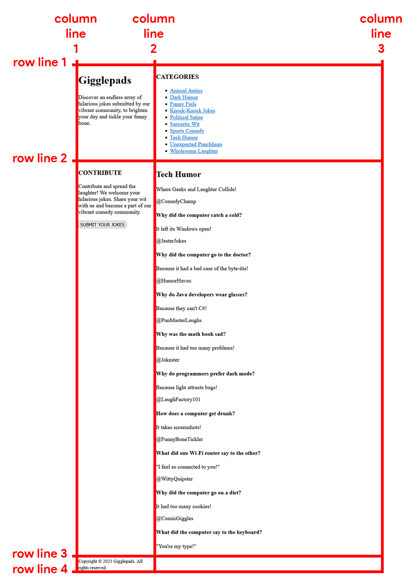

## CSS | Activity #1 (Guided): Grid Layout, Fonts, Colors, and Whitespaces
In this activity, we will create a webpage called **Gigglepads** with the following content:


---

### Development Setup
Create your `index.html` file inside the [**src**](/src) folder in this project,
then follow along with this guide.

To test your output, simply open it in your preferred web browser.

---

### Layout
For this webpage, we're going to be using the following HTML layout tags:

| Layout Tag  | Description                                     |
|-------------|-------------------------------------------------|
| `<header>`  | Defines a header for a document or a section.   |
| `<nav>`     | Defines a set of navigation links.              |
| `<aside>`   | Defines content aside from the content.         |
| `<main>`    | Defines the main content of a document.         |
| `<section>` | Defines a section in a document.                |
| `<article>` | Defines an independent, self-contained content. |
| `<footer>`  | Defines a footer for a document or a section.   |


HTML layout tags are important because they provide a clear
and semantic structure to web content,
making it easier for developers to understand and style different parts.
Despite functioning similarly to regular `<div>` tags,
the use of layout tags:
- enhances code readability,
- promotes better accessibility, and
- improves [Search Engine Optimization (**SEO**)](https://searchengineland.com/guide/what-is-seo)

---

### HTML Template
Without any styles, our template will resemble our HTML activity outputs.


We will simply use the HTML layout tags to define the relevant parts of our webpage:

```html
<!DOCTYPE html>
<html lang="en">
<head>
    <meta charset="UTF-8">
    <title>Gigglepads</title>
</head>
<body>
<!-- Container (Grid) -->
<div>

    <!-- Header -->
    <header>
        <h1>Gigglepads</h1>
        <p>
            Discover an endless array of hilarious jokes
            submitted by our vibrant community,
            to brighten your day and tickle your funny bone.
        </p>
    </header>

    <!-- Navigation -->
    <nav>
        <h3>CATEGORIES</h3>
        <ul>
            <li>
                <a href="#">Animal Antics</a>
            </li>
            <li>
                <a href="#">Dark Humor</a>
            </li>
            <li>
                <a href="#">Funny Fails</a>
            </li>
            <li>
                <a href="#">Knock-Knock Jokes</a>
            </li>
            <li>
                <a href="#">Political Satire</a>
            </li>
            <li>
                <a href="#">Sarcastic Wit</a>
            </li>
            <li>
                <a href="#">Sports Comedy</a>
            </li>
            <li>
                <a href="#">Tech Humor</a>
            </li>
            <li>
                <a href="#">Unexpected Punchlines</a>
            </li>
            <li>
                <a href="#">Wholesome Laughter</a>
            </li>
        </ul>
    </nav>

    <!-- Aside Content -->
    <aside>
        <h3>CONTRIBUTE</h3>
        <p>
            Contribute and spread the laughter! We welcome your hilarious jokes.
            Share your wit with us and become a part of our vibrant comedy community.
        </p>
        <form>
            <button>SUBMIT YOUR JOKES</button>
        </form>
    </aside>

    <!-- Main Content -->
    <main>
        <h2>Tech Humor</h2>
        <p>Where Geeks and Laughter Collide!</p>

        <!-- Jokes Section (Grid) -->
        <section>
            <!-- Joke #1 -->
            <article>
                <p>@ComedyChamp</p>
                <h4>Why did the computer catch a cold?</h4>
                <p>It left its Windows open!</p>
            </article>

            <!-- Joke #2 -->
            <article>
                <p>@JesterJokes</p>
                <h4>Why did the computer go to the doctor?</h4>
                <p>Because it had a bad case of the byte-itis!</p>

            </article>

            <!-- Joke #3 -->
            <article>
                <p>@HumorHavoc</p>
                <h4>Why do Java developers wear glasses?</h4>
                <p>Because they can't C#!</p>
            </article>

            <!-- Joke #4 -->
            <article>
                <p>@PunMasterLaughs</p>
                <h4>Why was the math book sad?</h4>
                <p>Because it had too many problems!</p>
            </article>

            <!-- Joke #5 -->
            <article>
                <p>@Jokester</p>
                <h4>Why do programmers prefer dark mode?</h4>
                <p>Because light attracts bugs!</p>
            </article>

            <!-- Joke #6 -->
            <article>
                <p>@LaughFactory101</p>
                <h4>How does a computer get drunk?</h4>
                <p>It takes screenshots!</p>
            </article>

            <!-- Joke #7 -->
            <article>
                <p>@FunnyBoneTickler</p>
                <h4>What did one Wi-Fi router say to the other?</h4>
                <p>"I feel so connected to you!"</p>
            </article>

            <!-- Joke #8 -->
            <article>
                <p>@WittyQuipster</p>
                <h4>Why did the computer go on a diet?</h4>
                <p>It had too many cookies!</p>
            </article>

            <!-- Joke #9 -->
            <article>
                <p>@ComicGiggles</p>
                <h4>What did the computer say to the keyboard?</h4>
                <p>"You're my type!"</p>
            </article>
        </section>
    </main>

    <!-- Footer -->
    <footer>
        <small>Copyright &copy; 2023 Gigglepads. All rights reserved.</small>
    </footer>

</div>
</body>
</html>
```
---

### What is CSS?
**CSS**, short for **Cascading Style Sheets**,
is a language used to specify the visual presentation of HTML elements.
It involves defining styles through property-value pairs,
where each pair is connected by a `:` colon and ended with a `;` semicolon.
For instance, an example of a CSS property and value could be:
```css
font-size: 16px;
```
which sets the **font size** of a selected element to ***16 pixels***.

### Writing CSS
When it comes to writing CSS styles, there are three different approaches:

#### 1. Inline Styles
Styles are directly applied to individual HTML elements using the `style` attribute.

*Example:*
```html
...

<p style="font-size: 16px; color: red;">CSS is Fun!</p>

...
```
In this example, the paragraph element
has been styled with a **font-size** of ***16 pixels***
and a text **color** of ***red***.

#### 2. Internal Stylesheets
Styles are defined within the HTML file using the
`<style>` tag in the `<head>`.

*Example:*
```html
<!DOCTYPE html>
<html lang="en">
<head>
    <meta charset="UTF-8">
    <style>
        p {
            font-size: 16px;
            color: red;
        }
    </style>
</head>
<body>
    <p>CSS is Fun!</p>
</body>
</html>
```

In this example,  every paragraph element
has been selected using the ***selector*** `p`
and has been styled with a **font-size** of ***16 pixels*** and a text **color** of ***red***.

#### 3. External Stylesheets
Styles are stored in separate CSS files and linked to HTML files using the `<link/>` tag.

*Example:*
##### `index.html`
```html
<!DOCTYPE html>
<html lang="en">
<head>
    <meta charset="UTF-8">
    <link rel="stylesheet" href="index.css"/>
</head>
<body>
    <p>CSS is Fun!</p>
</body>
</html>
```
##### `index.css`
```css
p {
    font-size: 16px;
    color: red;
}
```

In this example, the CSS styles are stored in a separate file called `index.css`.
These styles are linked to the HTML page using the `<link/>` tag with its `href` attribute.

---

### Styling Gigglepads
For this project, we will start by using **Inline Styles**.

#### 1. Grid Layout
A grid consists of **rows** (aligned vertically) and **columns** (aligned horizontally).


To create a grid layout for our **Container** element,
we use the CSS style `"display: grid;"`.

```html
...

<!-- Container (Grid) -->
<div style="
    display: grid;
">

...
```

##### Columns

By design, a webpage can have multiple rows,
but it should have a predetermined number of columns
because vertical scrolling is more convenient.

To set the column proportions in a grid,
we use the CSS property `grid-template-columns` that contains
a space-separated value representing the measurement of each column
using the unit `fr` that means **"fraction."**

In our project, we want a grid with two columns,
where the second column is three times wider than the first.
So, for our **Container** element,
the column definition is `"grid-template-columns: 1fr 3fr;"`.

```html
...

<!-- Container (Grid) -->
<div style="
    display: grid;
    grid-template-columns: 1fr 3fr;
">

...
```

##### Rows
Once we define the columns in a grid, the rows are automatically created.
Each direct child element of the grid fills in the corresponding column we defined.


##### Gaps
**Grid gaps** are the spaces between columns and rows in a grid.
To set it, we can use the CSS properties `grid-column-gap` and `grid-row-gap` respectively.
These properties accept measurements in `px` which means **"pixels."**

In our project, we will set the gap between columns and rows to ***8 pixels***.

```html
...

<!-- Container (Grid) -->
<div style="
    display: grid;
    grid-template-columns: 1fr 3fr;
    grid-column-gap: 8px;
    grid-row-gap: 8px;
">

...
```

##### Lines
**Grid lines** are the vertical and horizontal divisions that create rows and columns within the grid.
They are numbered starting from 1.



**Grid lines** allow us to position grid items by specifying where items start and end on the grid lines.

***Apply the following styles to each specific layout element and observe the output in your browser for each change:***

###### Header
In our project, we want the `<header>` element to span across two columns.
To achieve this, we set its `grid-column-start` to `1` and `grid-column-end` to `3`.

```html
    ...

    <!-- Header -->
    <header style="
        grid-column-start: 1;
        grid-column-end: 3;
    ">
        
    ...
```

###### Navigation
Since the `<header>` now occupies the entire **row 1**,
the `<nav>` element has been automatically pushed down to **column 1** of **row 2**.
We are already satisfied with its column position,
but to ensure that it always spans from **row line 2** down to **row line 3**,
we set its `grid-row-start` to `2` and `grid-row-end` to `3`.

```html
    ...
    
    <!-- Navigation -->
    <nav style="
        grid-row-start: 2;
        grid-row-end: 3;
    ">
        
    ...
```

###### Aside Content
Since the `<aside>` element is defined right after the `<nav>` element,
it occupies the available space next to the `<nav>` element: **column 2** of **row 2**.
Currently, we are not sure how to span the `<aside>` element,
but one thing is certain: it should start at **row line 3**.
To achieve this, we set its `grid-row-start` to `3`.

```html
    ...
    
    <!-- Aside Content -->
    <aside style="
        grid-row-start: 3;
    ">
        
    ...
```

###### Main Content
After moving the `<aside>` element to **row 3**,
the `<main>` element automatically filled its previous position: **column 2** of **row 2**.
We are already satisfied with its column position.
However, it is currently confined to **row 2**,
causing the `<nav>` element to have an enormous height.
To address this, we need to span the `<main>` element
from **row line 2** to **row line 5**,
so that its lengthy content doesn't affect the height of the `<nav>` and `<aside>` elements.
To accomplish this, we set its `grid-row-start` to `2` and `grid-row-end` to `5`.

```html
    ...
    
    <!-- Main Content -->
    <main style="
        grid-row-start: 2;
        grid-row-end: 5;
    ">
    
    ...
```

###### Footer
After adjusting the spanning of rows of our `<main>` element, we created **row 4**.
However, the `<footer>` element automatically occupied the available space: **column 1** of **row 4**.
We want the `<footer>` to start at **row line 5** instead,
so we set its `grid-row-start` to `5`. This process creates **row 5**.

Additionally, similar to the `<header>` element,
we also want the `<footer>` to span from
**column line 1** to **column line 3**.
Therefore, we need to set its `grid-column-start` to `1` and `grid-column-end` to `3`.

```html
    ...
    
    <footer style="
        grid-row-start: 5;
        grid-column-start: 1;
        grid-column-end: 3;
    ">
        
    ...
```

###### Jokes Section
In addition to the previous layout adjustments,
we have another grid layout for the **Jokes Section**.
To make it a grid, we set its `display` property to `grid`.

This `<section>` has three columns with equal sizes.
To achieve this, we set its `grid-template-columns` to `1fr 1fr 1fr`.

To adjust the grid gap between columns and rows,
we can set its `grid-column-gap` and `grid-row-gap` to ***8 pixels***.

Furthermore, we can set the minimum height of the grid elements within the **Jokes Section** to ***130 pixels***.
This is done by setting its `grid-auto-rows` to `minmax(130px, auto)`.
This means the grid elements will have a minimum height of `130px`
but can expand *"automatically"* based on their content.

```html
        ...
        
        <section style="
            display: grid;
            grid-template-columns: 1fr 1fr 1fr;
            grid-column-gap: 8px;
            grid-row-gap: 8px;
            grid-auto-rows: minmax(130px, auto);
        ">
        
        ...
```
