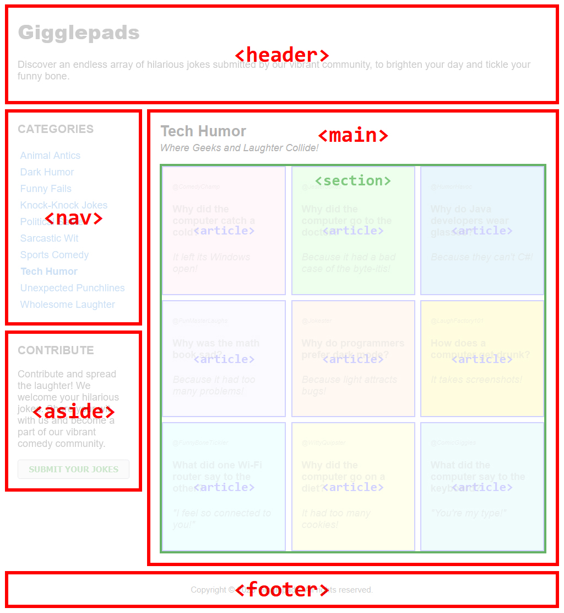
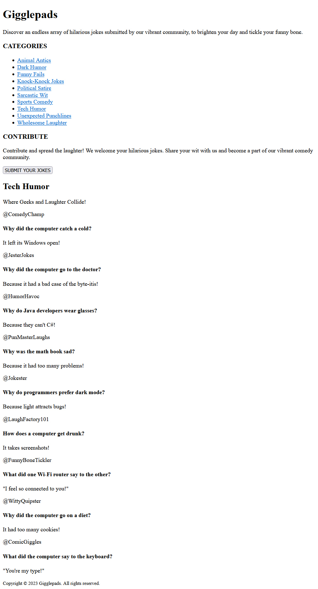

## CSS | Activity #1 (Guided): Grid Layout, Colors, and Fonts
In this activity, we will create a webpage called **Gigglepads** with the following content:


---

### Development Setup
Create your `index.html` file inside the [**src**](/src) folder in this project,
then follow along with this guide.

To test your output, simply open it in your preferred web browser.

---

### Layout
For this webpage, we're going to be using the following HTML layout tags:

| Layout Tag  | Description                                     |
|-------------|-------------------------------------------------|
| `<header>`  | Defines a header for a document or a section.   |
| `<nav>`     | Defines a set of navigation links.              |
| `<aside>`   | Defines content aside from the content.         |
| `<main>`    | Defines the main content of a document.         |
| `<section>` | Defines a section in a document.                |
| `<article>` | Defines an independent, self-contained content. |
| `<footer>`  | Defines a footer for a document or a section.   |




HTML layout tags are important because they provide a clear
and semantic structure to web content,
making it easier for developers to understand and style different parts.
Despite functioning similarly to regular `<div>` tags,
the use of layout tags:
- enhances code readability,
- promotes better accessibility, and
- improves [Search Engine Optimization (**SEO**)](https://searchengineland.com/guide/what-is-seo)

---

### HTML Template
Without any styles, our template will resemble our HTML activity outputs.




We will simply use the HTML layout tags to define the relevant parts of our webpage:

```html
<!DOCTYPE html>
<html lang="en">
<head>
    <meta charset="UTF-8">
    <title>Gigglepads</title>
</head>
<body>
<!-- Container (Grid) -->
<div>

    <!-- Header -->
    <header>
        <h1>Gigglepads</h1>
        <p>
            Enter the Gigglepads, where laughter knows no bounds!
            Discover an endless array of hilarious jokes
            submitted by our vibrant community,
            to brighten your day and tickle your funny bone.
        </p>
    </header>

    <!-- Navigation -->
    <nav>
        <h3>CATEGORIES</h3>
        <ul>
            <li>
                <a href="#">Animal Antics</a>
            </li>
            <li>
                <a href="#">Dark Humor</a>
            </li>
            <li>
                <a href="#">Funny Fails</a>
            </li>
            <li>
                <a href="#">Knock-Knock Jokes</a>
            </li>
            <li>
                <a href="#">Political Satire</a>
            </li>
            <li>
                <a href="#">Sarcastic Wit</a>
            </li>
            <li>
                <a href="#">Sports Comedy</a>
            </li>
            <li>
                <a href="#">Tech Humor</a>
            </li>
            <li>
                <a href="#">Unexpected Punchlines</a>
            </li>
            <li>
                <a href="#">Wholesome Laughter</a>
            </li>
        </ul>
    </nav>

    <!-- Aside Content -->
    <aside>
        <h3>CONTRIBUTE</h3>
        <p>
            Contribute and spread the laughter! We welcome your hilarious jokes.
            Share your wit with us and become a part of our vibrant comedy community.
        </p>
        <form>
            <button>SUBMIT YOUR JOKES</button>
        </form>
    </aside>

    <!-- Main Content -->
    <main>
        <h2>Tech Humor</h2>
        <p>Where Geeks and Laughter Collide!</p>

        <!-- Jokes Section (Grid) -->
        <section>
            <!-- Joke #1 -->
            <article>
                <p>@ComedyChamp</p>
                <h4>Why did the computer catch a cold?</h4>
                <p>It left its Windows open!</p>
            </article>

            <!-- Joke #2 -->
            <article>
                <p>@JesterJokes</p>
                <h4>Why did the computer go to the doctor?</h4>
                <p>Because it had a bad case of the byte-itis!</p>

            </article>

            <!-- Joke #3 -->
            <article>
                <p>@HumorHavoc</p>
                <h4>Why do Java developers wear glasses?</h4>
                <p>Because they can't C#!</p>
            </article>

            <!-- Joke #4 -->
            <article>
                <p>@PunMasterLaughs</p>
                <h4>Why was the math book sad?</h4>
                <p>Because it had too many problems!</p>
            </article>

            <!-- Joke #5 -->
            <article>
                <p>@Jokester</p>
                <h4>Why do programmers prefer dark mode?</h4>
                <p>Because light attracts bugs!</p>
            </article>

            <!-- Joke #6 -->
            <article>
                <p>@LaughFactory101</p>
                <h4>How does a computer get drunk?</h4>
                <p>It takes screenshots!</p>
            </article>

            <!-- Joke #7 -->
            <article>
                <p>@FunnyBoneTickler</p>
                <h4>What did one Wi-Fi router say to the other?</h4>
                <p>"I feel so connected to you!"</p>
            </article>

            <!-- Joke #8 -->
            <article>
                <p>@WittyQuipster</p>
                <h4>Why did the computer go on a diet?</h4>
                <p>It had too many cookies!</p>
            </article>

            <!-- Joke #9 -->
            <article>
                <p>@ComicGiggles</p>
                <h4>What did the computer say to the keyboard?</h4>
                <p>"You're my type!"</p>
            </article>
        </section>
    </main>

    <!-- Footer -->
    <footer>
        <small>Copyright &copy; 2023 Gigglepads. All rights reserved.</small>
    </footer>

</div>
</body>
</html>
```
